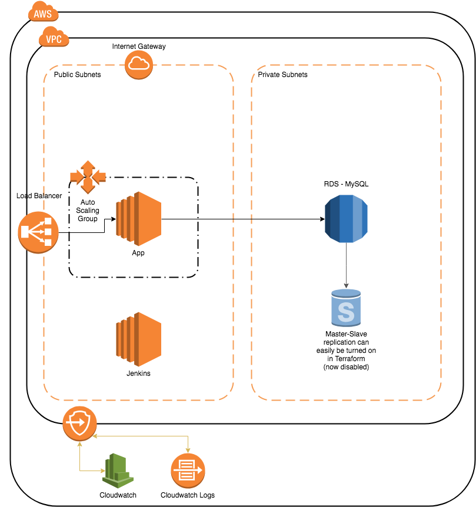

## Requirements - DevOps

Install terraform and packer on your machine:

```
https://www.terraform.io/downloads.html
https://www.packer.io/intro/getting-started/install.html
```

Install ansible on your machine with:

```
  $ pip install -U ansible==2.6.7
```

## Architecture

The entire architecture in AWS is launched using Terraform, and the EC2
instances are provisioned using Ansible. Ansible is triggered directly in
Terraform so that the instances automatically get provisioned once they are
launched and ready.

The architecture below contains:
  1. One AutoScaling Group (aka ASG) with a Launch Configuration.
     ASG has a starting capacity of 1.
  2. One application server, which can scale with the ASG
  3. One Classic Load Balancer that redirect to the application instance(s).
  4. One Jenkins server (EC2 instance) for Continuous Integration
  5. One RDS MySQL instance for the app.
     I chose MySQL even though it is not fully ACID compliant, but RDS-MySQL
     has an out-of-the-box integration to CloudWatch Logs for all database logs.
     Another great option of database would have been PostgreSQL but RDS does
     not support the CloudWatch Logs integration yet.

**Note**: Sensitive information is encrypted using ansible-vault.
The ansible-vault password is required to run the ansible scripts.

See architecture here:


Mounted volumes legend:

  - Application server:
    - xvda: Root directory (8GB)

  - Jenkins:
    - xvda: Root directory (8GB)
    - xvdb: /mnt (2GB): Used to store temporary backups before they are moved to S3
    - xvdf: /var/lib/jenkins (5GB): Used to store jenkins data. This volume is backed up every night.

  - RDS-MySQL:
    - Storage allocation: 10GB.
      Snapshots will be taken every night, and the snapshot will be kept for 7 days.

## Provision

Create a [new AWS CLI profile](https://docs.aws.amazon.com/cli/latest/userguide/cli-chap-getting-started.html),
in `~/.aws/credentials` using the IAM credentials that have access to
launch/update the AWS architecture. Remember the name of the profile you just
created, because it will be required later in the aws_profile variable in
Terraform.

Get the Ansible vault password, then store it in a gitignored file using:

```
  $ echo "replace-vaultpass-here" > ansible/.ansiblevaultpass
```

Create/Update the Terraform configuration:

```
  $ cp terraform.tfvars.sample terraform.tfvars
  Then edit terraform.tfvars and make sure these variables are updated:
    - aws_profile
    - localip
    - dbname
    - dbuser
    - dbpassword
    - key_name
    - public_key_path
    - private_key_path
```

Launch architecture using Packer and Terraform:

```
  $ ./jenkins/refresh_ami.sh
  $ terraform init
  $ terraform apply
```

The last command will output the URL of the load balancer for the application
server, along with the database URL and the Jenkins url.

**Note**: As explained inside the terraform script, the RDS instance does not
have the multi_az configuration turned on for cost purposes. But it can easily
be uncommented in the terraform script (main.tf), and applied onto the
architecture.

### DevOps Updates

When updating the ansible or Terraform code, please make sure to run the
linter script:

```
  $ ./devops_linter.sh
```

## Continuous Integration

I am using Jenkins for the automated Continuous Integration.
Jenkins is widely-used for its big community and its variety of plugins that
make CI much easier to handle. In my case, the [Performance plugin](https://wiki.jenkins.io/display/JENKINS/Performance+Plugin)
is what made me use Jenkins as the CI instead of another CI service.
The Performance plugin allows to measure and detect performance regression based
off of a jMeter script.

All scripts that are run inside jenkins jobs actually live inside the `jenkins/`
directory in this repository.

Here is the list of Jenkins Jobs and their description:

  - **run_unit_tests**: runs run_unit_tests.sh, which sets up the virtualenv, and
    runs `python tests.py` on jenkins.
    If this job is successful, it automatically triggers the performance tests
    below.
  - **run_performance_tests**: runs run_performance_tests.sh, which runs the jMeter
    script in jmeter-app.jmx and compares the results with the average of
    the past few runs. This job essentially runs performance regression tests.
    If this job is successful, it automatically triggers the deployment job
    below.
  - **deploy_prod**: runs deploy.sh, which itself runs refresh_ami.sh
    followed by a terraform update. More details in the `Deployments` section
    below.
  - **backup_jenkins_data**: runs ansible script in ansible/backup_jenkins_data.yml,
    which zips all the jenkins data and configuration in /var/lib/jenkins, and
    sends the backup file to S3. The temporary backup is stored in a mounted
    volume in /mnt to avoid disk usage overload on the root volume.


## Deployments

The deployments contains multiple steps:

  - Validate: See automated unit tests and performance tests in Jenkins.
  - Package AMI with new code: I am using packer to spin up a base ubuntu 18.04
    instance, and install all the system packages, pip packages, virtualenv,
    deploy code, and check permissions.
    Then packer bakes an AMI from that instance, then destroys that instance.
  - Blue/Green deployment: The B/G deployment is happening at the AutoScaling
    Group (ASG) level. When the new AMI is ready, a new ASG is launched and the
    Load Balancer is switched from the old ASG to the new one without any
    downtime. I did not want to have a B/G deployment at the ELB level, since it
    would require an ELB pre-warming, which requires reaching out to AWS.
  - Voila! The new architecture is deployed and it can automatically scale.
    See "Scaling the application" section below.

## Scaling the application

The application can scale in 2 ways: manually or automatically

### Manually

Terraform makes it very easy to scale servers manually.
In `main.tf`, look out for the resource called:
`resource "aws_autoscaling_group" "myapp_asg"`

When you find it, add a parameter inside the resource:

```
desired_capacity = 3
```

Also make sure that the desired_capacity is between the min and the max.

Once it's reviewed by one of your peers, and the Pull Request is merged to
master, the Jenkins jobs will automatically trigger in cascade and scale the
ASG using the desired capacity that you have set in the code.

### Automatically

In the terraform configuration, you can find 2 alarms that will automatically
scale-up or scale-down the application based on CPU Utilization:

  - If the Average CPU is higher than 70% twice in a row, it will trigger
    a scale-up event that will add one instance to the ASG.
  - If the Average CPU is lower than 20% twice in a row, it will trigger
    a scale-down event that will remove one instance from the ASG.


## Backup Schedule

There are 2 places where data needs to be backed up every night:

  - RDS Database: RDS has automated backups/snapshots running from 8.00 AM to
    8.30 AM UTC (therefore 3 AM EST). Since the database is currently a
    single-instance, as explained previously in this README, AWS indicates that
    it will "result in a brief I/O suspension that can last from a few seconds
    to a few minutes".
    If the multi_az option was to be turned on in main.tf, the snapshot would
    have no downtime at all.
  - Jenkins Data: The data in /var/lib/jenkins needs to be backed up every
    night since it is a mutable directory and a service interruption can cause
    delay and inconvenience for the development team when trying to release
    what they need. This backup is running as a Jenkins job every night at 8AM
    UTC (therefore 3 AM EST).

## Logging

All logs are being pushed to CloudWatch Logs, and can be reviewed whenever
needed with anyone that has access to it.
All logs are shipped to CloudWatch Logs within a minute of being written to a
file on the local server.
There are 3 logs groups:

  - RDS: Contains MySQL logs generated by RDS
  - jenkins.domain.com: Contains syslog, nginx and jenkins logs
  - cname.domain.com: Contains syslog, nginx and gunicorn logs

## Monitoring

All the core metrics (CPU, Memory Usage, I/O) are sent to CloudWatch, but at
this time, there is no SNS notifications set up for any of these metrics.
So the system is not sending any emails or texts if anything reaches a specific
threshold. However they are all available for troubleshooting purposes.

## Improvements?

As DevOps is about creating a continuous improvement cycle towards a better
system, I would like to outline what the next improvements could be for this
project:

  - For the base Ubuntu AMI, we are always using Ubuntu's base AMI, that we
    keep on dist-upgrading and installing packages to.
    It can be helpful to start from scratch every time if we are rarely
    releasing, and the releases include package updates or Ubuntu LTS upgrade.
    But if we are releasing a lot of code changes, then it can be a little
    repetitive and inefficient to keep starting from scratch instead of having
    our own base AMI, that we keep on updating.
  - In order to keep the state of the terraform infrastructure consistent
    across all the machines running the terraform command, the terraform.tfstate
    should be committed to the repository.
    However, for security, committing the tfstate can be tricky, since it
    contains password and sensitive data from the variables.
    So before it can be committed, a process needs to be created where passwords
    are replaced before being committed.
